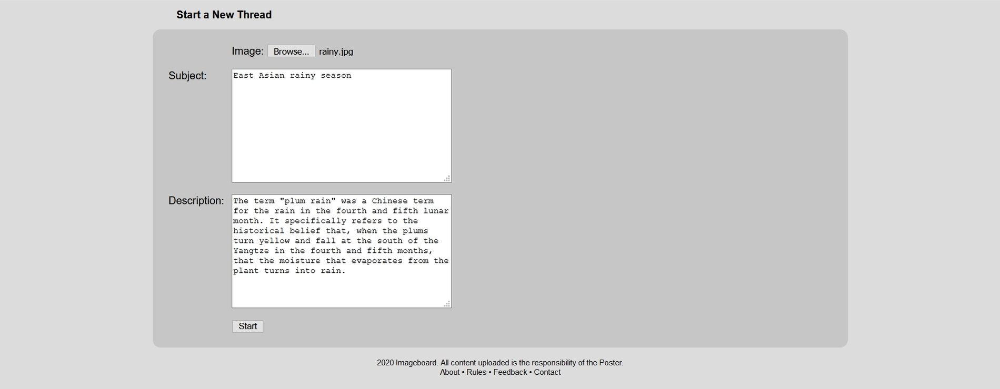
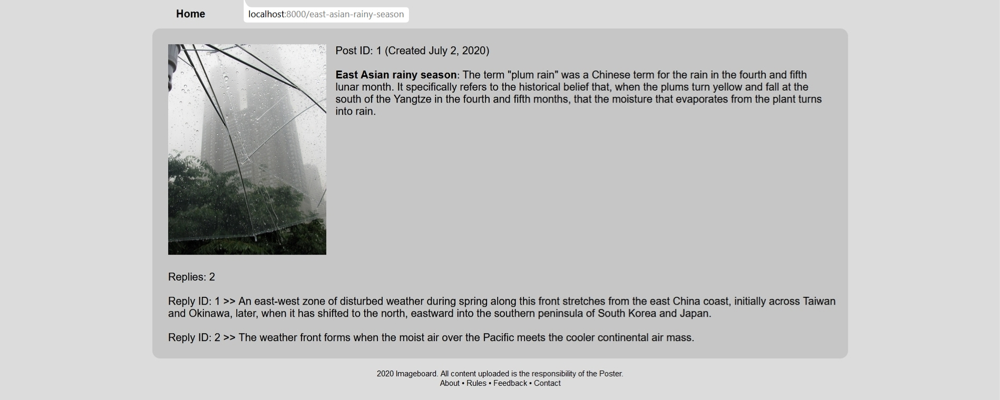

## Setup instructions:

* Create a Python environment and install the required packages:
```
pip install -r requirements.txt
```
* Create a MySQL database and a user with all privileges needed to edit it granted;
* Set 'ALLOWED_HOSTS' to '*' in order to allow the custom error pages to load;
* Connect the database with the project via local settings file ('settings_local' must be created manually) and make the following changes to 'settings_local':
  * Set the 'SECRET_KEY' value inside local settings file;
  * Set 'DEBUG' to 'True';
  * Copy the 'DATABASES' block from the main settings file and fill all of the required fields:
```
DATABASES = {
    'default': {
        'ENGINE': 'django.db.backends.mysql',
        'NAME': '',
        'USER': '',
        'PASSWORD': '',
        'HOST': '',
        'PORT': '',
    }
}
```
* Migrate the database;
* Create a superuser to access the admin page.


## Interface

### Homepage:
All new posts appear on the index page of the imageboard. Post image, amount of replies and thread creation date appear in the first row of post description.
Post subject and the main body of text (truncated to 15 words) are displayed in the second row.


### Starting a new thread:
When clicking on the [New Thread] link, the thread creation interface is loaded, before each thread's creation three fields must be filled: image, subject and description (main body of text).
Thread slug address is generated from its subject field contents.



### Replying to threads:
Freshly created threads can be replied to by clicking [Reply] below the thread image (at the homepage), old threads are locked automatically when new ones are created.


### Thread page:
Individual thread page becomes available when a thread is started, post ID and thread creation date are displayed together with an enlarged version of the post image, its subject and full description.
Quantity of replies and the replies themselves with their database IDs are displayed below the image. Each thread has a slug address generated from its subject in lowercase where spaces are replaced with dashes.

